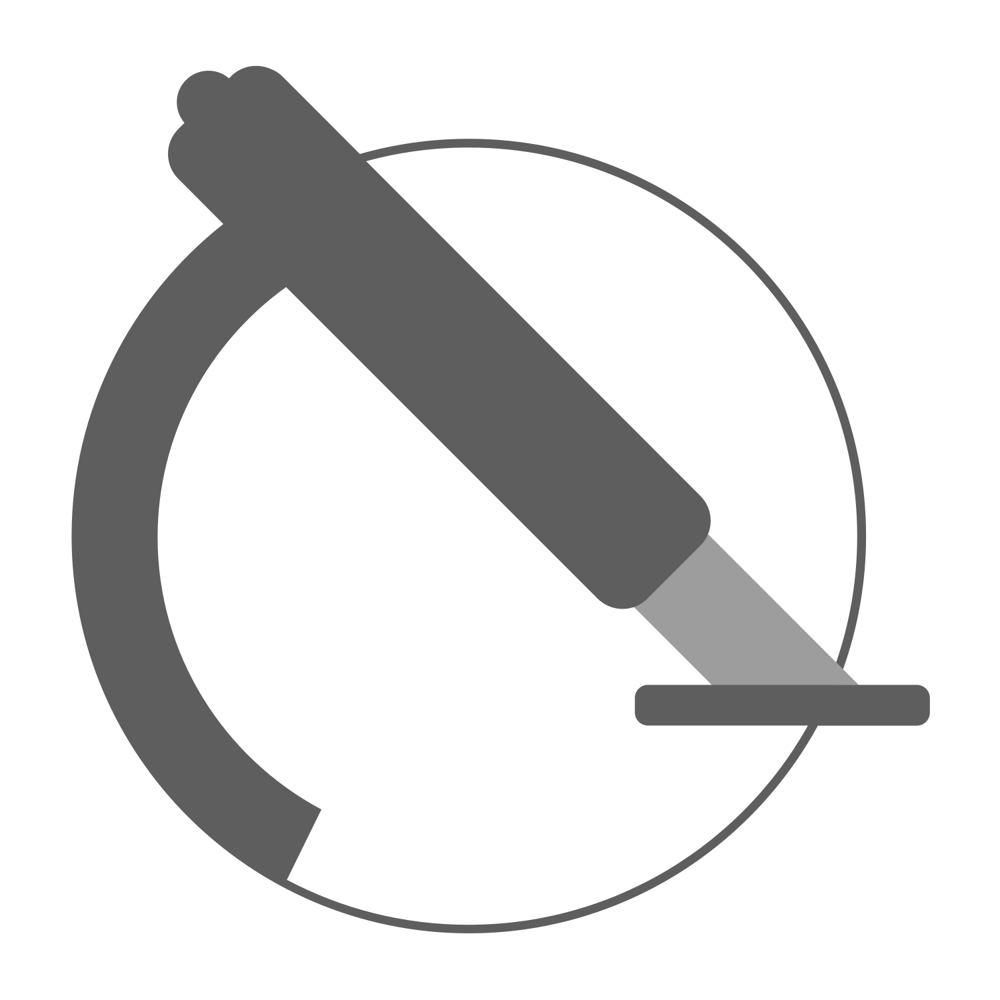
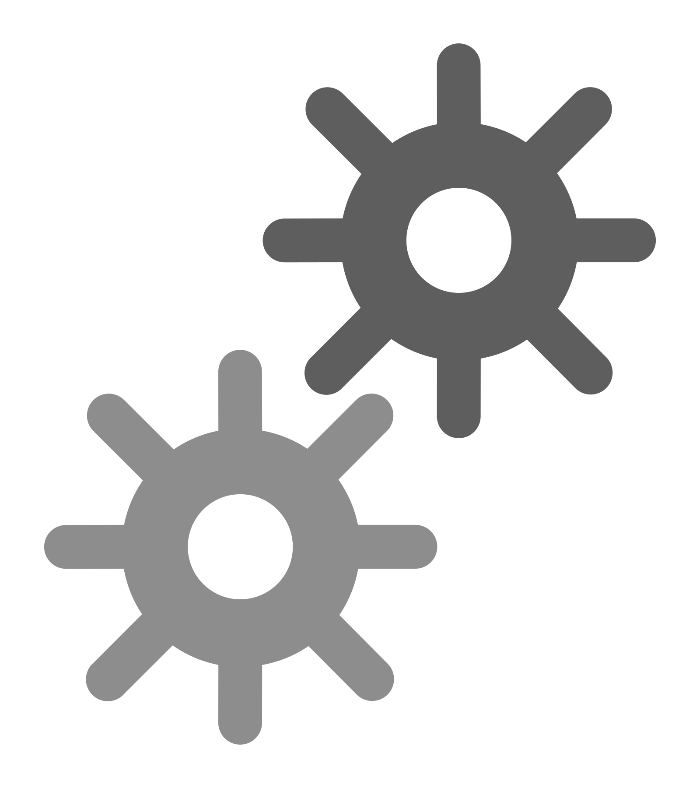
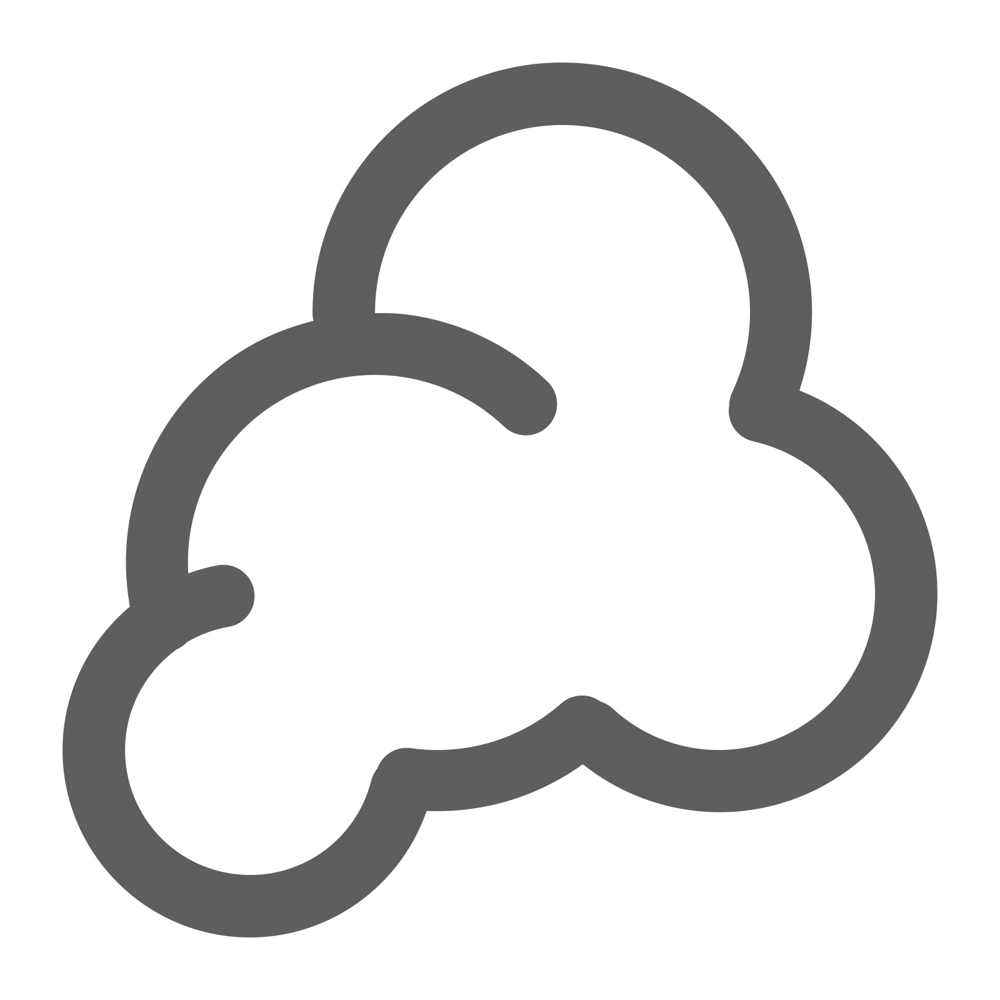
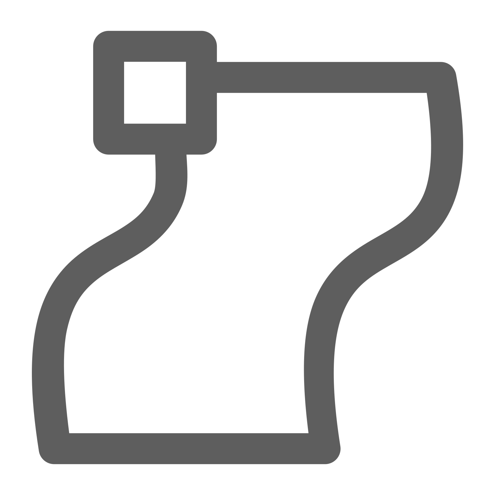
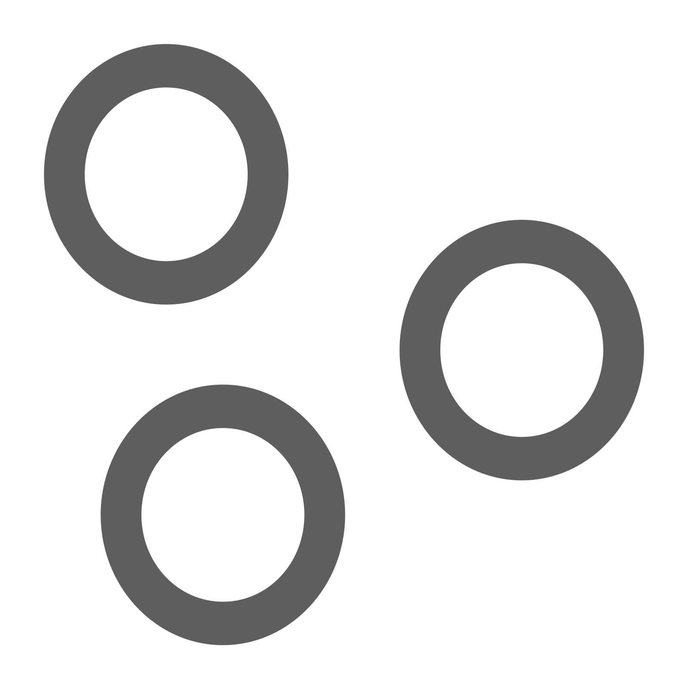
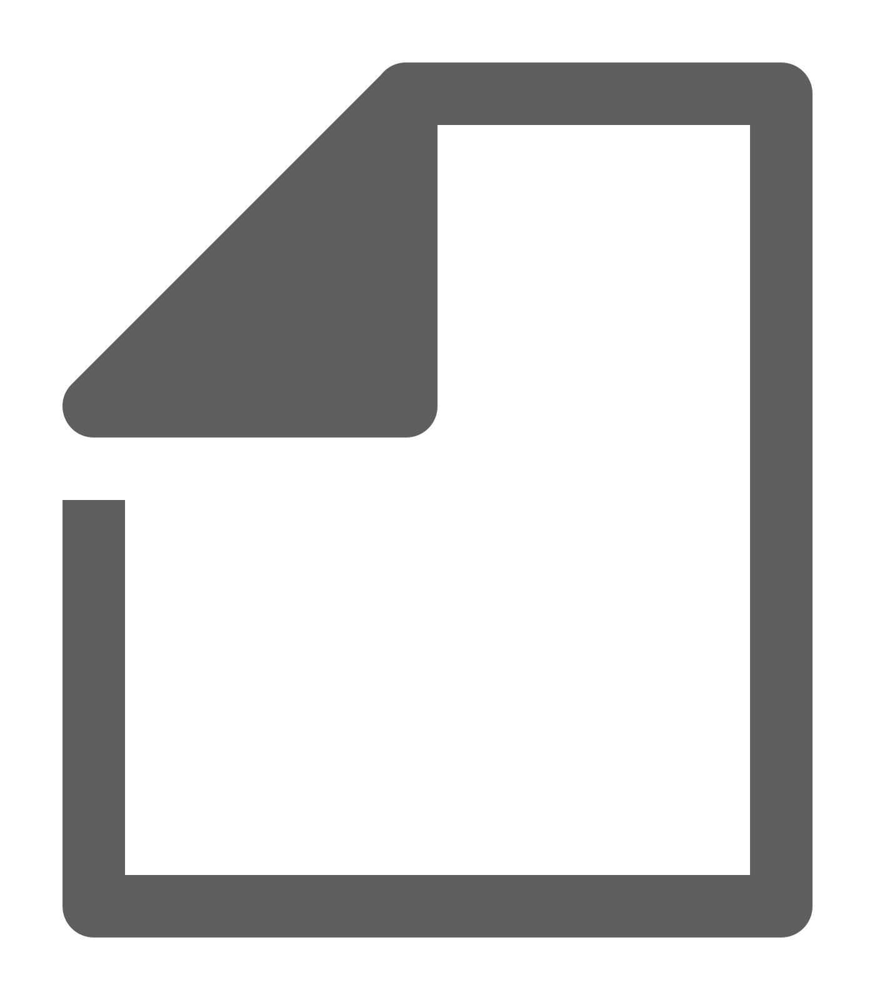
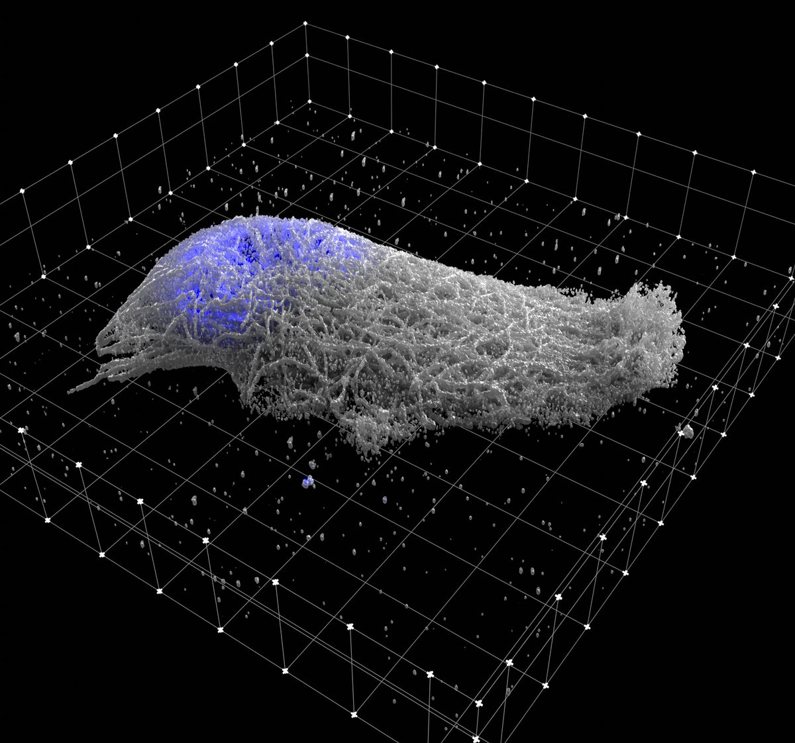

#  Microscopy in Blender

**Microscopy Nodes** is a Blender add-on for visualizing high-dimensional microscopy data—designed for scientists, or anyone working with biological images 😊.

 For any type of microscopy: fluorescence, electron microscopy, or anything in between! This tool helps you turn complex 3D+ datasets into stunning, accurate, and animatable visualizations. 

Usage questions are mainly answered on the [image.sc forum](https://forum.image.sc/tag/microscopy-nodes)

##   What It Does

Microscopy Nodes supports importing **up to 5D** microscopy datasets (XYZ + time + channels) from `.tif` and **OME-Zarr** files, setting easy and adaptable settings to start with visualizing your data.


| Feature | Description |
|--------|-------------|
| **5D Support** | Load `.tif` and `.zarr` files with any axis order 'tzcyx' or any subset |
| **Channel Interface** | Define how to load each channel:  volume,  surface,  label mask |
| **Colors and LUTs** | Easy picking of colors per channel or non-linear LUT selection from [many colormaps](https://cmap-docs.readthedocs.io/en/stable/).  |
| **Intuitive Slicing** | Slice any object by moving the Slicing Cube, as you would move any other Blender object |
| **Scales** | 3D scale grid for accurate representation and physical Blender scales for easy registration.  |
| **Large Volumes** | Build your animation and visualization on a downscaled version, render with your massive dataset! |


##  Installation

You can grab the add-on on the [Blender Extensions Platform](https://extensions.blender.org/add-ons/microscopynodes/)  
Or, search **Microscopy Nodes** in Blender Preferences → Get Extensions. (Blender 4.2+)

For earlier versions, check the [legacy install guide](https://aafkegros.github.io/MicroscopyNodes/outdated).

Once installed, find it under Scene Properties  .

##   Video tutorials

Check out the [video tutorials](https://www.youtube.com/@aafkegros) on YouTube for quick guides on:
- Installation
- Loading data
- Fluorescence & EM visualization
- Making presentation-ready renders

<p align="center"></p>


## First use

1. Load your file (local path or URL) into the **Microscopy Nodes** panel in Scene Properties  
2. The metadata will auto-load, and you can define how each channel is visualized
3. Adjust per-channel options like:
   - Volume or isosurface rendering
   - Label masks
   - Emission, resolution, and colors
4. Customize dataset settings like:
   - Axis order
   - Physical pixel size
   - Reload behavior & storage location

More detail in the [full docs](https://aafkegros.github.io/MicroscopyNodes/).

## Show Off Your Vizualizations!

If you create something cool using `Microscopy Nodes`, share it!  
Tag me [@aafkegros on Bluesky](https://bsky.app/profile/aafkegros.bsky.social) or use the hashtag `#microscopynodes`.

If you publish with this add-on, please cite [the paper](https://link.springer.com/article/10.1038/s44319-025-00654-8):
```

@article{gros_microscopy_2026,
	title = {Microscopy {Nodes}: versatile {3D} microscopy visualization with {Blender}},
	volume = {27},
	issn = {1469-3178},
	shorttitle = {Microscopy {Nodes}},
	url = {https://doi.org/10.1038/s44319-025-00654-8},
	doi = {10.1038/s44319-025-00654-8},
	language = {en},
	number = {3},
	urldate = {2026-02-17},
	journal = {EMBO Reports},
	author = {Gros, Aafke and Bhickta, Chandni and Lokaj, Granita and Johnston, Brady and Schwab, Yannick and Köhler, Simone and Banterle, Niccolò},
	month = feb,
	year = {2026},
	keywords = {3D Data, Blender, Data Visualization, Electron Microscopy, Fluorescence Microscopy},
	pages = {581--597},
	file = {Full Text PDF:/Users/oanegros/Zotero/storage/SF7NNTUC/Gros et al. - 2026 - Microscopy Nodes versatile 3D microscopy visualiz.pdf:application/pdf},
}
} 
```

