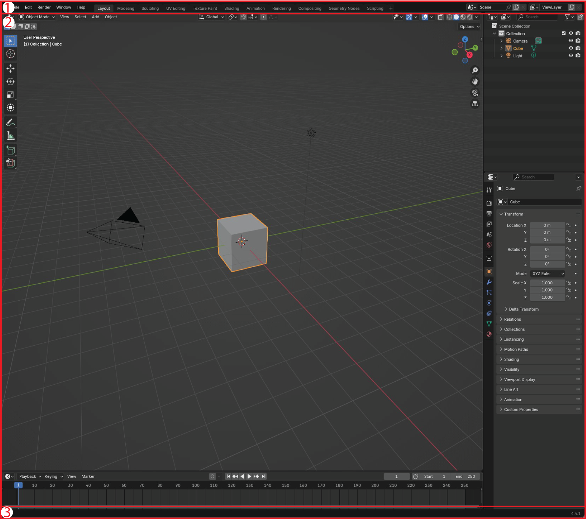
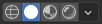

# 1. First Use

## **Installing Microscopy Nodes**

{{ youtube("BFMX0Dk5rIw", 360, 200) }}

1. Open Blender.
2. Navigate to `Edit > Preferences`.
3. In the Add-ons tab, search for `Microscopy Nodes`.
4. Click **Install** to download and enable the add-on.
5. (Optional) Adjust additional settings in Preferences.

## **Blender Interface Overview**
This tutorial gives an overview into the Blender interface, and highlight all the key things to know if you're only or mostly interacting with microscopy data. 

Further information and navigation can be found in the [Blender Manual](https://docs.blender.org/manual/en/latest/editors/3dview/navigate/index.html)

The Blender interface always contains: 

1. {{ svg("topbar") }} {{ svg("topbar") }}	**The top bar**: contains the main menus and selection of the tabs, or *workspaces* (e.g. Layout, Shading, Geometry Nodes).
2. {{ svg("workspace") }} **The main workspace**: Reconfigurable workspace. Contains different areas depending on the selected *workspace*.
3. {{ svg("statusbar") }} **The status bar**: contains shortcuts suggestions

But it can be configured much more with **workspaces** {{ svg("workspace") }}. Currently we're in the **Layout** workspace.

## Layout Workspace 

The **Layout** workspace {{ svg("workspace") }}  (by default selected in the {{ svg("topbar") }} *topbar*) is our main workspace, made for assembling and seeing your 3D scene.

1. {{ svg("view3d") }} **3D Viewport**: Main 3D interaction area. 
1. {{ svg("outliner") }} **Outliner**: Tree view of all objects in the *scene*. This is the easiest place to *select* objects.
1. {{ svg("properties") }} **Properties Editor**: Edit properties of the scene and the selected object. Under  you can find *Microscopy Nodes*.
1. {{ svg("time") }} **Timeline**: For animation.

With Microscopy Nodes, we also use the [Shading]() workspace, and for advanced users, the [Geometry Nodes]() and [Scripting]() workspaces.

## Navigation in the 3D Viewport

Annotated on the right in the image are widgets you can drag to **rotate** (axes), {{ svg("view_zoom") }} **scale** and {{ svg("view_pan") }} **move** the view.

Mouse navigation is possible and configurable in the [Preferences](https://docs.blender.org/manual/en/latest/editors/preferences/input.html). This depends on which input device you use (2-button mouse, 3-button mouse, touchpad).

### The `View` menu
At the top of the 3D viewport, there is a dropdown menu called `View` - this has shortcuts and other tools to align the view. 

For example, if you lose all the objects in the scene, you can select an object in the **outliner** on the top right, and use the menu `View > Frame Selected` (or just `View > Frame All`) to see your scene again.

## Manipulating Objects

Annotated on the left in the image are widgets you can drag to **select**, **move**, **rotate** and **scale** objects. The transform widgets spawn a *gizmo*: a mouse-clickable interaction interface:

Transforms can also be done with hotkeys: `G` for grab/move, `R` for rotate, `S` for scale. The transformation can be locked to an axis with the `X`, `Y` or`Z` key.

### Adding an object

At the top of the 3D viewport is an `Add` menu, from which you can add different primitive objects, such as a camera or lights. This is also findable under the key combination `Shift + A`

To add microscopy data, there is a [separate loading window](docs/tutorials/2_loading_data.md).

### Deleting objects

You can select any object in the Viewport or Outliner, and delete it by `Right Mouse Button > Delete Object` or pressing `X` and confirming.

For deleting all objects in the scene, it is fastest to press `A` to select all objects and `X` to delete them. 

In the **Outliner**, an entire group can be deleted at once with  `Right Mouse Button > Delete Hierarchy`

## **Viewport rendering**

In the top right of the viewport you can change the way the contents are shown. 

{{ svg("microscopy_nodes") }} Microscopy Nodes volume data will only be visible in **Material Preview** and **Rendered** mode.

From left to right:

1.	{{ svg("shading_wire") }} **Wireframe** : Only the object skeleton, *No volumetric data shown.*
2.	{{ svg("shading_solid") }} **Solid Mode**: Only the external surfaces are drawn 
3.	{{ svg("shading_texture") }} **Material Preview**: Is meant for previewing your scene without full calculations. Defaults to [EEVEE](TODO). May be a fast view, but will be slow to open with microscopy data, and is data-dependent. 
4.	{{ svg("shading_rendered") }} **Rendered**: Shows the scene as it will appear in the final render. By default, Microscopy Nodes sets this to be in Cycles. Often the best way to currently view microscopy data.

## **Further UI instruction** 

  

    

    

      Click to load video from YouTube.
       
      By clicking, you agree to YouTube’s privacy policy.
    

  

