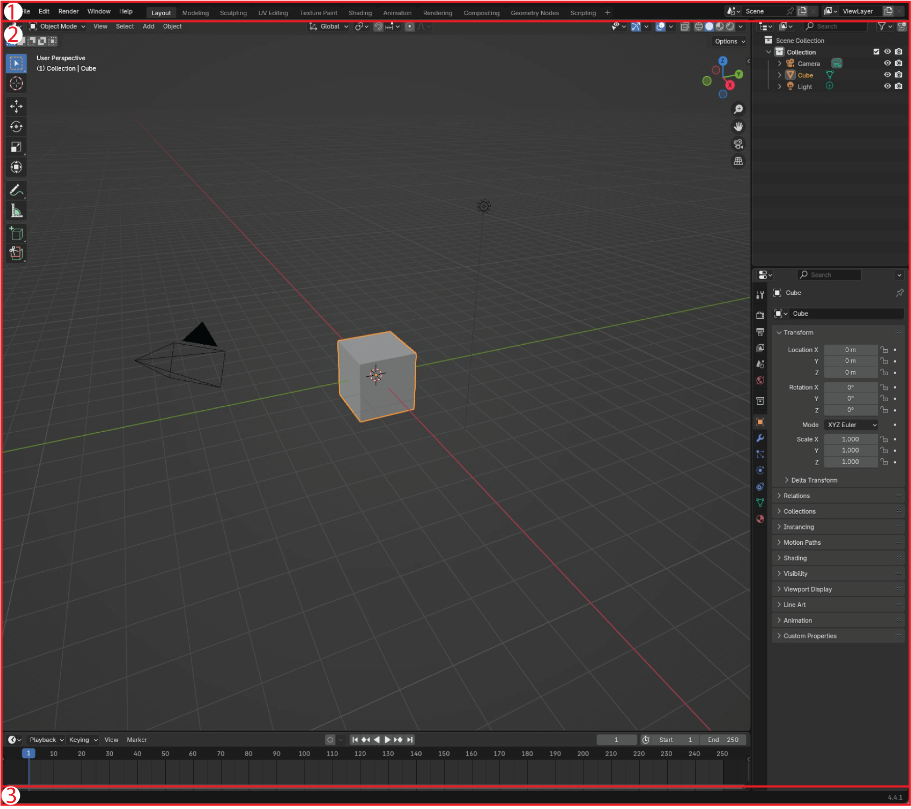
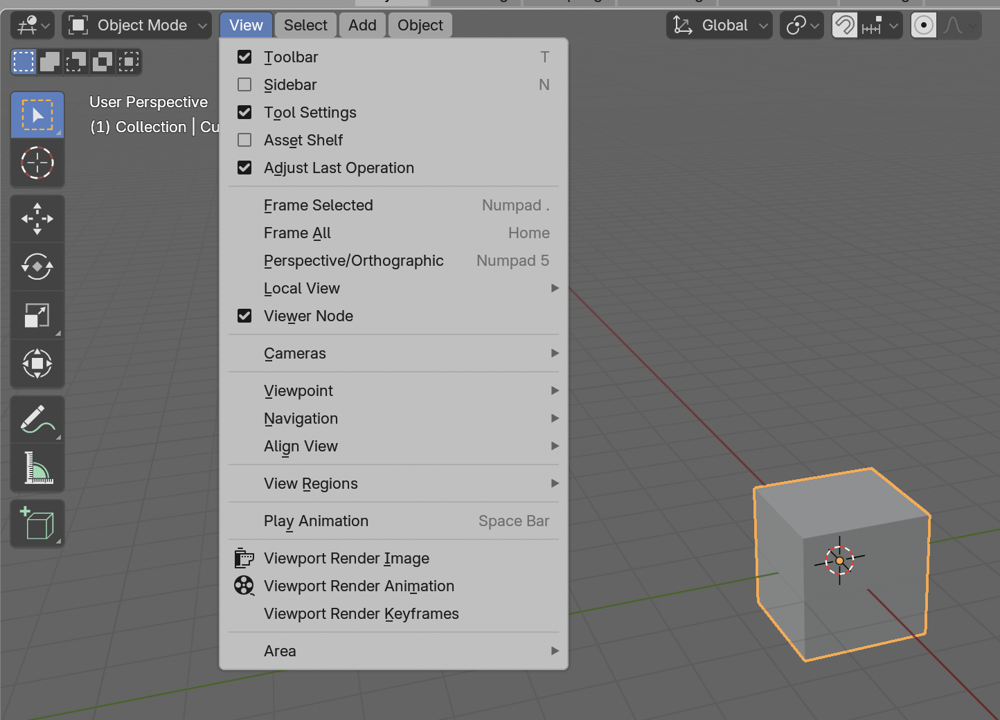
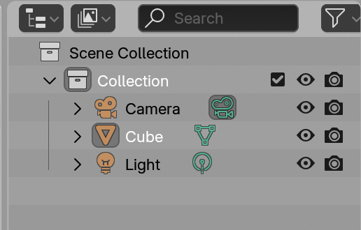
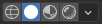

# Install and learn Blender basics

These instructions apply to **Microscopy Nodes 3.1** with **Blender 5.2 or newer**.

## **Installing Microscopy Nodes**

{{ youtube("BFMX0Dk5rIw", 360, 200) }}

1. Open Blender.
2. Navigate to `Edit > Preferences`.
3. Open **Get Extensions** and search for `Microscopy Nodes`.
4. Click **Install** to download and enable the add-on.

After installation, the :blender-MICROSCOPY_NODES: Microscopy Nodes panel is available in the :blender-SCENE_DATA: Scene Properties.

## **Blender Interface Overview**
The Blender interface is very flexible and can be reconfigured in many ways. While this is a powerful feature, it also means that explaining the basics can be a bit technical, and some of the terms are Blender **jargon**. To make things easier, here is a quick overview of some **key terms** and where to find common functions.

Further information and navigation can be found in the :blender-BLENDER: [Blender Manual](https://docs.blender.org/manual/en/latest/editors/3dview/navigate/index.html)

The Blender interface always contains: 

1. :blender-TOPBAR:	**Top bar**: contains the main menus and selection of the tabs, or  :blender-WORKSPACE: workspaces (e.g. Layout, Shading, Geometry Nodes).
2. :blender-WORKSPACE: **Workspace**: Reconfigurable workspace. Contains different areas depending on the selection in the  :blender-TOPBAR: topbar.
3. :blender-STATUSBAR: **Status bar**: contains shortcuts suggestions

But it can be configured much more with **workspaces** :blender-WORKSPACE:. Currently we're in the **Layout** workspace.

## Layout Workspace 

The **Layout** workspace :blender-WORKSPACE:  (by default selected in the :blender-TOPBAR: *topbar*) is our main workspace, made for assembling and seeing your 3D scene. This contains multiple elements with Blender-specific names:

1. :blender-VIEW3D: **3D Viewport**: Main 3D interaction area. 
1. :blender-OUTLINER: **Outliner**: Tree view of all objects in the *scene*. This is the easiest place to *select* objects.
2. :blender-PROPERTIES: **Properties Editor**: Edit properties of the scene and the selected object. Under :blender-SCENE_DATA: you can find *Microscopy Nodes*.
3. :blender-TIME: **Timeline**: For animation.

With Microscopy Nodes, we also use the [Shading]() workspace, and for advanced users, the [Geometry Nodes]() and [Scripting]() workspaces.

## The 3D Viewport

Annotated on the right in the image are widgets you can drag to **rotate** (axes), :blender-VIEW_ZOOM: **scale** and :blender-VIEW_PAN: **move** the view.

Mouse navigation is possible and configurable in the :blender-BLENDER: [Preferences](https://docs.blender.org/manual/en/latest/editors/preferences/input.html). This depends on which input device you use (2-button mouse, 3-button mouse, touchpad).

### The `View` menu
 
{: style="height:200px"}

At the top of the :blender-VIEW3D: 3D viewport, there is a dropdown menu called `View` - this has shortcuts and other tools to align the view. 

For example, if you lose all the objects in the scene, you can select an object in the :blender-OUTLINER: outliner in the top right, and use the menu `View > Frame Selected` (or just `View > Frame All`) to see your scene again.

## The outliner

The :blender-OUTLINER: outliner lists all :blender-OUTLINER_COLLECTION: collections and objects in the scene. Here you can **select** objects more easily.

This also provides an interface for **visibility** in the :blender-HIDE_OFF:/:blender-HIDE_ON: 3D viewport, and in the :blender-RESTRICT_RENDER_OFF:/:blender-RESTRICT_RENDER_ON: final render. If objects are not visible, they are also not loaded into RAM, so it can speed up Blender to limit visibility.

## Manipulating Objects

Annotated on the left in the image are widgets you can drag to **select**, **move**, **rotate** and **scale** objects. The transform widgets spawn a *gizmo*: a mouse-clickable interaction interface:

Transforms can also be done with hotkeys: `G` for grab/move, `R` for rotate, `S` for scale. The transformation can be locked to an axis with the `X`, `Y` or`Z` key.

### Adding an object

At the top of the 3D viewport is an `Add` menu, from which you can add different primitive objects, such as a camera or lights. This is also findable under the key combination `Shift + A`

To add microscopy data, there is a [separate loading window](./2_loading_data.md).

### Deleting objects

You can select any object in the :blender-VIEW3D: viewport or :blender-OUTLINER: outliner, and delete it by `Right Mouse Button > Delete Object` or pressing `X` and confirming.

For deleting all objects in the scene, it is fastest to press `A` to select all objects and `X` to delete them. 

In the :blender-OUTLINER: **outliner**, an entire group can be deleted at once with  `Right Mouse Button > Delete Hierarchy`

## **Viewport rendering**

In the top right of the viewport you can change the way the contents are shown. 

:blender-MICROSCOPY_NODES: Microscopy Nodes volume data will only be visible in **Material Preview** and **Rendered** mode.

From left to right:

1.	:blender-SHADING_WIRE: **Wireframe** : Only the object skeleton, *No volumetric data shown.*
2.	:blender-SHADING_SOLID: **Solid Mode**: Only the external surfaces are drawn 
3.	:blender-SHADING_TEXTURE: **Material Preview**: Is meant for previewing your scene without full calculations. Defaults to [EEVEE](./rendering.md#eevee). May be a fast view, but will be slow to open with microscopy data, and is data-dependent. 
4.	:blender-SHADING_RENDERED: **Rendered**: Shows the scene as it will appear in the final render. By default, Microscopy Nodes sets this to be in [Cycles](./rendering.md#cycles). Often the best way to view microscopy data.

## **Further UI instruction (video)** 

  

    

    

      Click to load video from YouTube.
       
      By clicking, you agree to YouTube’s privacy policy.
    

  

