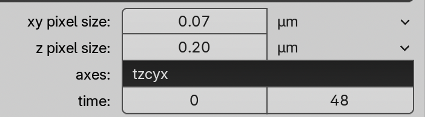
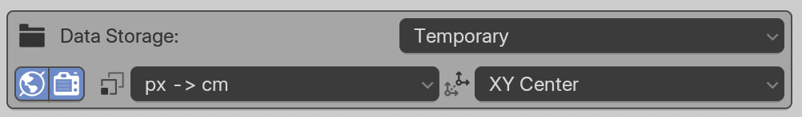

# Loading microscopy data 

## Video tutorials

The **Fluorescence** tutorial shows how to load *emissive* data, and the **EM** tutorial shows how to load *scattering data*, these settings can be good to interchange!

{{ youtube("lroStEHiPV8", 280, 158) }}
{{ youtube("Rwq7Tu8Avss", 280, 158) }}

The **labelmask/surface** tutorial is shown for EM data, but can be useful for any data type and binary or label masks:

{{ youtube("YO3FxTFGH00", 280, 158) }}

## 1. Point to your data

1.	[Delete](./1_start#deleting-objects) everything in the scene with `A` and `X`

2.	In the {{ svg("scene_data") }}  Scene Properties panel, find the **{{ svg("microscopy_nodes") }} {{ svg("microscopy_nodes") }} Microscopy Nodes** panel. 
1. Provide the path to your data set:
   >  local TIFF file (preferably imagej-tif, but others work)

    > OME-Zarr URL

    > local OME-Zarr folder 

For **local files**, you can use the file explorer {{ svg("file_folder") }}. 

{{ svg("error") }} With OME-Zarr, **copy the address directly** into the field. OME-Zarr links are not clickable. If the metadata does not populate, check out our tips for [troubleshooting OME-Zarr](./ome_zarr_troubleshooting.md).

!!! example "Example OME-Zarr datasets:"
    - [https://s3.embl.de/microscopynodes/RPE1_4x.zarr](https://s3.embl.de/microscopynodes/RPE1_4x.zarr) ; Showing expansion microscopy of an RPE1 cell with cytoskeletal elements stained
    - [https://s3.embl.de/microscopynodes/FIBSEM_dino_masks.zarr](https://s3.embl.de/microscopynodes/FIBSEM_dino_masks.zarr) ; Showing a dinoflagellate FIB-SEM dataset with segmentations
    - The [Image Data Resource OME-Zarr archive](https://idr.github.io/ome-ngff-samples/). Some may [not work](./ome_zarr_troubleshooting).

## 2. Select scale *(optional)*

Microscopy Nodes **automatically** selects the smallest scale of data available. 

Downscaled versions get created if the data is over 4 GiB per timepoint. For OME-Zarr, all premade scales also get shown.

Any scale with a volume icon  {{ svg("outliner_data_volume") }} will easily work in any part of Blender. The `1` icon is of a size where a single channel will definitely work. Going above? Check out the [large data tutorial](./large_data.md).

## 3. Check metadata

The metadata populates **automatically** from the file:

This contains:

- Pixel Sizes
  > This may be truncated in the view, up to 6 decimal places are used.
- Pixel Units 
  > Å to m, or 'arbritrary unit (a.u)'
- Axis order
  > A piece of text such as 'tzcyx'. number of letters needs to match the number of axes. Allows remapping of order or letter.
- Time (only if time axis exists)
  > Start and end frame, allows you to clip a time axis before loading.

## 4. Set channels

Next we see the channel interface:

From left to right:

- Channel name (editable)
- Visualization types:
    - Volume {{ svg("outliner_data_volume") }}    
    - Surface {{ svg("outliner_data_surface") }}    
    - Labelmask {{ svg("outliner_data_pointcloud") }} 
- Emission on/off {{ svg("light") }}
- Colormap type:
    - Single Color {{ svg("mesh_plane") }}    
    - Linear {{ svg("ipo_linear") }}
    - Diverging {{ svg("lincurve") }} 
    - Categorical {{ svg("outliner_data_pointcloud") }} 
- Color Picker ( if {{ svg("mesh_plane") }} )

The **Visualization type** defines which [objects](./3_objects.md) will be loaded. If **none** are clicked in a channel, this channel will not be loaded. 

When loading with **Emission** on, the objects of this channel will by default emit light. If this is off, they will reflect/scatter light from the scene or background.

The **Colormap** choice gives basic options for color before loading. If 
{{ svg("mesh_plane") }} Single Color is picked, the colormap will be linearly black -> color picked in the color picker. 

Defaults can be changed in the [preferences](./preferences.md)

!!! warning "Labelmasks"
    Labelmasks {{ svg("outliner_data_pointcloud", "small-icon") }} expect an array with separate integer values per object. If it gets a data channel, it will try to still split it into separate objects

## 5. Extra import settings (optional)
These settings are below the `Load` button as they are not essential to remap for your first load. They can be useful to change if you're using Microscopy Nodes more often, or have specific needs. Most of these will persist between sessions.

This includes the **Data Storage** - where the intermediate files get stored

- Temporary (Default)
  > Puts the data in a temporary file, you can check the temporary path in the [preferences](./preferences.md)
- Path
  > Gives a field to put in a location. 
- With Project
  > Will create a folder next to the project location. Requires that the project is saved

{{ svg("world") }} overwrite the world color upon loading. This is useful as the world color (white, black or grey) is used as default lighting.

{{ svg("scene") }} overwrite [render settings](./rendering.md) upon loading. This turns itself off after the first load, to avoid overwriting custom settings.

{{ svg("con_sizelike") }} defines the **input transform** - Blender works in meters, but *Microscopy Nodes* uses this as multiple optional coordinate spaces:

- `px -> cm`
  > Default, scales the object such that each pixel takes about 1 cm space in XY. Scales the Z axis such that it is isotropic with XY.
- `Å -> m`
- `nm -> m`
- `µm -> m`
- `mm -> m`
- `m -> m`
- `nm -> cm (Molecular Nodes)` 

{{ svg("orientation_parent") }} defines the **input location**:

- `XY Center`
- `XYZ Center`
- `Origin`

!!! warning "Choosing an input transform"
    Note that you may need to go one scale higher than you expect with the {{ svg("con_sizelike", "small-icon") }} input transform, as a few meters is already quite large (the default cube is 2 m). The normal unit is the size of your dataset, and not always the unit of your pixel size.

## 6. Load 

Press the big `Load` button to load a dataset
