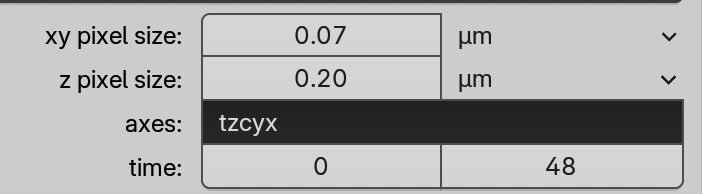

# Load microscopy data

Microscopy Nodes uses the same loading workflow for fluorescence, dense EM, segmentations, and time series. What changes is the representation and visualization chosen for each channel.

{{ youtube("CsunbIn3ABw", 560, 315) }}

## 1. Point to your data

1.	[Delete](./1_start.md#deleting-objects) everything in the scene with `A` and `X`

2.	In the {{ svg("scene_data") }}  Scene Properties panel, find the **{{ svg("microscopy_nodes") }} Microscopy Nodes** panel. 
3. Provide the path to your data set:
   >  local TIFF file (preferably imagej-tif, but others work)

    > OME-Zarr URL

    > local OME-Zarr folder 

For **local files**, you can use the file explorer {{ svg("file_folder") }}. 

{{ svg("error") }} With OME-Zarr URLs/folders, **copy the address directly** into the field. OME-Zarr links are not clickable. If the metadata does not populate, check out our tips for [troubleshooting OME-Zarr](./ome_zarr_troubleshooting.md).

!!! example "Example OME-Zarr datasets:"
    - [https://s3.embl.de/microscopynodes/RPE1_4x.zarr](https://s3.embl.de/microscopynodes/RPE1_4x.zarr) ; Showing expansion microscopy of an RPE1 cell with cytoskeletal elements stained
    - [https://s3.embl.de/microscopynodes/FIBSEM_dino_masks.zarr](https://s3.embl.de/microscopynodes/FIBSEM_dino_masks.zarr) ; Showing a dinoflagellate FIB-SEM dataset with segmentations
    - The [Image Data Resource OME-Zarr archive](https://idr.github.io/ome-ngff-samples/). Some may [not work](./ome_zarr_troubleshooting.md).

## 2. Select scale *(optional)*

Microscopy Nodes **automatically** selects the smallest scale of data available. 

If the source data is larger than **1 GiB per timepoint**, Microscopy Nodes automatically offers additional downscaled versions. This applies to both **TIFF** and **OME-Zarr** sources. For OME-Zarr, any multiscale levels already stored in the source are shown as well.

Any scale with a volume icon  {{ svg("outliner_data_volume") }} will easily work in any part of Blender. The `1` icon is of a size where a single channel will definitely work. For larger datasets, check out the [large data tutorial](./large_data.md).

## 3. Check metadata

The metadata populates **automatically** from the file:

This contains:

- Pixel Sizes
  > This may be truncated in the view, up to 6 decimal places are used.
- Pixel Units 
  > Å, nm, µm, mm, or m
- Axis order
  > A piece of text such as 'tzcyx'. number of letters needs to match the number of axes. Allows remapping of axis order by editing the text field.
- Time (only if time axis exists)
  > Start and end frame, allows you to clip the time axis before loading.

## 4. Set channels

Next we see the channel interface:

From left to right:

- Channel name (editable)
- Visualization types:
    - Volume {{ svg("outliner_data_volume") }}    
    - Surface {{ svg("outliner_data_surface") }}    
    - Labelmask {{ svg("outliner_data_pointcloud") }} 
- Emission on/off {{ svg("light") }}
- Colormap type:
    - Single Color {{ svg("mesh_plane") }}    
    - Linear {{ svg("ipo_linear") }}
    - Diverging {{ svg("lincurve") }} 
    - Categorical {{ svg("outliner_data_pointcloud") }} 
- Color Picker ( if {{ svg("mesh_plane") }} )

The **Visualization type** defines which [objects](./3_objects.md) will be loaded. If **none** are clicked in a channel, this channel will not be loaded. 

When loading with **Emission** on {{ svg("outliner_ob_light") }}, the objects of this channel will by default emit light. If this is off {{ svg("light") }}, they will reflect/scatter light from the scene or background.

The **Colormap** choice gives basic options for color before loading. If 
{{ svg("mesh_plane") }} Single Color is picked, the colormap will be linearly black -> color picked in the color picker. 

Defaults can be changed in the [preferences](./preferences.md).

!!! warning "Labelmasks"
    Labelmasks {{ svg("outliner_data_pointcloud", "small-icon") }} expect an array with separate integer values per object. If it gets a data channel, it will try to still split it into separate objects

## 5. Extra import settings (optional)
These settings are below the **Load** button. Most users can leave them at their defaults for a first load.

The panel is ordered as follows:

1. **On load – Scene**
    - {{ svg("world") }} sets the world color to white when any non-emissive channel is loaded, or black when all loaded channels emit light.
    - {{ svg("scene") }} applies Microscopy Nodes' responsive render defaults. It turns itself off after a successful load so later loads do not overwrite settings you have changed.
2. **On load – Slicing**
    - {{ svg("geometry_nodes") }} **Geometry** adds a **Mask Grid** or **Mask Mesh** node to each loaded data object. This supports arbitrary masks and sparse reloading, but its voxelized boundaries can look stepped.
    - {{ svg("material") }} **Shader** clips the rendered material with the Slice Cube. It gives a clean box boundary but does not mask the underlying data.
3. **Data Storage** chooses where converted VDB and mesh cache files are written:

- Temporary (Default)
  > Puts the data in a temporary file, you can check the temporary path in the [preferences](./preferences.md)
- Path
  > Gives a field to put in a location. 
- With Project
  > Will create a folder next to the project location. Requires that the project is saved

The storage choice and default slicing mode persist in the add-on preferences.

## 6. Set coordinate scale and location

The {{ svg("con_sizelike") }} scale and {{ svg("orientation_parent") }} location controls sit below the extra-settings box. They are **responsive controls**, not one-time loading options: changing either one updates an already loaded dataset immediately.

{{ svg("con_sizelike") }} **Microscopy scale → Blender scale** converts the physical units of the dataset into Blender meters. **Auto** chooses a practical scene size. Manual choices are available for nm, µm, mm, and m, with output scales in meters, decimeters, or centimeters; `nm → cm (Molecular Nodes)` matches Molecular Nodes conventions.

{{ svg("orientation_parent") }} defines the **input location**:

- `XY Center`
- `XYZ Center`
- `Origin`

The location is applied through the dataset's holder, so **XY Center**, **XYZ Center**, and **Origin** reposition the whole hierarchy without changing the data coordinates inside it.

## 7. Load

Press the big `Load` button to load a dataset

Switch the viewport to {{ svg("shading_texture") }} Material Preview or {{ svg("shading_rendered") }} Rendered Preview to see volume data. The resulting hierarchy contains a holder, the selected data objects, an Axes object, and a Slice Cube.

Next, use [Adjust color, contrast, and opacity](./visualization.md) to make the signal readable, or see [How Microscopy Nodes works](./workflow_overview.md) for an overview of the generated scene.

## 8. Reload data or settings

Point the {{ svg("file_refresh") }} Reload field to an existing Microscopy Nodes holder to update it instead of creating a new hierarchy.

- {{ svg("file") }} **Update data** replaces the underlying data, scale, or selected time range.
- {{ svg("material") }} **Update settings** reapplies channel representations, colors, emission choices, and other loading settings.

Turn off **Update settings** when replacing a small working scale with final high-resolution data while retaining shader edits. Turn off **Update data** when only the channel configuration needs to change.

For regional high-resolution loading, continue with [Large datasets and sparse reloading](./large_data.md).
