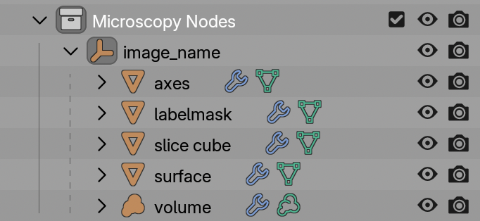

# 3. Objects

Microscopy Nodes loads your microscopy data as different types of **objects**, depending on how you loaded each channel.

Each type of object is placed in a {{ svg("outliner_ob_empty") }}  **holder** collection. The **Axes** and **Slice Cube** are always present.

You can select an object by clicking on it in the {{ svg("outliner") }} outliner (as shown in the screenshot) and change its properties:

- Change **underlying data** in the {{ svg("modifier") }} modifier menu of the {{ svg("properties") }} properties or the (*advanced*) Geometry Nodes workspace {{ svg("workspace") }} 
- Change **visualization** in the {{ svg("material") }} material menu of the {{ svg("properties") }} properties or the Shader Nodes workspace {{ svg("workspace") }} 

The exact settings and where to change them change per object, so see below.

---

## Holder 

The {{ svg("outliner_ob_empty") }} **Holder** is an empty object which is the `parent` of the other Microscopy Nodes objects. 

The holder can be **scaled**, **moved** and **rotated** and then **all of its objects** will be transformed along with it.

## Axes

The  {{ svg("outliner_ob_mesh") }} **Axes** object is always loaded with your dataset. It draws a **scale grid** based on the number of pixels, pixel size, and pixel unit.

-  {{ svg("modifier") }} Geometry options
    - `pixel unit` per tick
      > The distance between grid lines
    - Grid
      > Whether to draw a grid or only a box 
    - Line thickness
      > Thickness of lines in arbitrary units
    - Frontface culling
      > If ticked, clips out the axes that are closest to the camera or viewpoint, so that they do not obstruct the view.
    - Separate planes
      > For each plane (xy bottom, top etc) you can select whether they will be drawn

-  {{ svg("material") }} Shader options
    - Color 

Scale grids can be **moved**, **scaled** and **rotated** independently of the holder without losing their accuracy.

!!! note "Bars versus grids"
    In *Microscopy Nodes*, only scale grids are shown. Blender’s default cameras are perspective cameras, where traditional scale bars are not very meaningful. We'll probably add support for some form of scale bar in the future for orthographic renders.

---

## Volumes

The {{ svg("outliner_ob_volume") }} **Volume** holds channels of **volumetric** data, which can be rendered either as emitting or scattering light. It is generated when you enable {{ svg("outliner_ob_volume") }}  **Volume** during loading.

-  {{ svg("modifier") }} Geometry options
    - Included channels
      > If channels are not included, they are also not loaded into RAM 
-  {{ svg("material") }} [Shader options](./4_shading.md#volume-shading)
    - Pixel intensities
    - Opacity calculation
    - Color LUT

The easiest way to edit a volume shader is in the {{ svg("workspace") }} Shader Nodes workspace, where you can most easily switch between channels in the {{ svg("properties") }} properties.

You can toggle between emission and scattering modes using the {{ svg("light") }} emission toggle in [loading](./2_loading_data.md).

---

## Surfaces

The {{ svg("outliner_ob_mesh") }} **Surface** object is a mesh extracted from a volume using an **isosurface threshold**. It is generated when you enable {{ svg("outliner_ob_surface") }}  **Surface** during loading.

- {{ svg("modifier") }} Geometry options
    - Included channels
    - Threshold
      > The intensity value above which the surface is extracted. 
    - Voxel size *(only listed if {{ svg("preferences") }} [Mesh Resolution](./preferences.md) is not `Actual`)*
      > Interactive scalable unit for mesh detail

- {{ svg("material") }} [Shader options](./4_shading.md#surface-shading)
    - Standard mesh shading parameters (color, opacity etc)

---

## Label Masks

The {{ svg("outliner_ob_mesh") }} **Label Mask** object is a mesh generated from a **label image**, such as a segmentation channel. It is generated when you enable {{ svg("outliner_ob_pointcloud") }}  **Labelmask** during loading.

**Each value** in the volume is turned into a separate mesh.

- {{ svg("modifier") }} Geometry options
    - Included channels

- {{ svg("material") }} [Shader options](./4_shading.md#labelmask-shading)
    - Color per label 
    - Revolving colormap or linearly distributed among objects
    - Standard mesh shading parameters (color, opacity etc)

---

## Slice Cube

The {{ svg("outliner_ob_mesh") }} **Slice Cube** is a movable object that defines the visibility of other objects.

The slice cube is inherently nothing else than a Cube with a transparent shader. The linkage to its transparency is done from the {{ svg("material") }} shader **of the sliced object**. This means you can also add a new cube and point to this instead.

This has no {{ svg("modifier") }} Geometry options or {{ svg("material") }} Shader options

---

???+ info "How the **Microcopy Nodes** objects work"
    The data objects are Geometry Nodes objects that reference preloaded data stored in the `cache` collection. In the **Geometry Nodes** workspace {{ svg("workspace", "small-icon") }} you can add edit the loaded data and add modifiers.  
