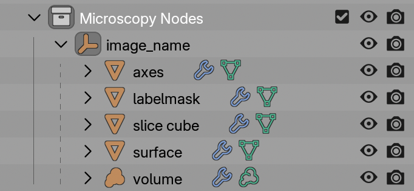

# Objects and modifiers

Microscopy Nodes loads your microscopy data as different types of **objects**, depending on how you loaded each channel.

Each type of object is placed in a :blender-OUTLINER_OB_EMPTY:  **holder** collection. The **Axes** and **Slice Cube** are always present.

You can select an object by clicking on it in the :blender-OUTLINER: outliner (as shown in the screenshot) and change its properties:

- Change **underlying data** in the :blender-MODIFIER: modifier menu of the :blender-PROPERTIES: properties or the (*advanced*) Geometry Nodes workspace :blender-WORKSPACE: 
- Change **visualization** in the :blender-MATERIAL: material menu of the :blender-PROPERTIES: properties or the Shader Nodes workspace :blender-WORKSPACE: 

The exact settings and where to change them change per object, so see below.

---

## Holder 

The :blender-OUTLINER_OB_EMPTY: **Holder** is an empty object which is the `parent` of the other Microscopy Nodes objects. 

The holder can be **scaled**, **moved** and **rotated** and then **all of its objects** will be transformed along with it.

## Axes

The  :blender-OUTLINER_OB_MESH: **Axes** object is always loaded with your dataset. It draws a **scale grid** based on the number of pixels, pixel size, and pixel unit.

-  :blender-MODIFIER: Geometry options
    - `pixel unit` per tick
      > The distance between grid lines
    - Grid
      > Whether to draw a grid or only a box 
    - Line thickness
      > Relative thickness of the grid lines
    - Frontface culling
      > If ticked, clips out the axes that are closest to the camera or viewpoint, so that they do not obstruct the view.
    - Separate planes
      > For each plane (xy bottom, top etc) you can select whether they will be drawn

-  :blender-MATERIAL: Shader options
    - Color 

Scale grids can be **moved**, **scaled** and **rotated** independently of the holder without losing their accuracy.

!!! note "Bars versus grids"
    Scale grids remain meaningful in a 3D perspective scene. A conventional scale bar is globally accurate only with an orthographic camera. Microscopy Nodes provides dynamic and rigid scale-bar nodes; see [Scale bars, grids, and time labels](./annotation.md).

---

## Volumes

The :blender-OUTLINER_OB_VOLUME: **Volume** holds channels of **volumetric** data, which can be rendered either as emitting or scattering light. It is generated when you enable :blender-OUTLINER_OB_VOLUME:  **Volume** during loading.

-  :blender-MODIFIER: Geometry options
    - Included channels
      > If channels are not included, they are also not loaded into RAM 
-  :blender-MATERIAL: [Shader options](./4_volume_shading.md)
    - Pixel intensities
    - Opacity calculation
    - Color LUT

The easiest way to edit a volume shader is in the :blender-WORKSPACE: Shader Nodes workspace, where you can most easily switch between channels in the :blender-PROPERTIES: properties.

You can toggle between emission and scattering modes using the :blender-LIGHT: emission toggle in [loading](./2_loading_data.md).

---

## Surfaces

The :blender-OUTLINER_OB_MESH: **Surface** object is a mesh extracted from a volume using an **isosurface threshold**. It is generated when you enable :blender-OUTLINER_OB_SURFACE:  **Surface** during loading.

- :blender-MODIFIER: Geometry options
    - Included channels
    - Threshold
      > The intensity value above which the surface is extracted. 
    - Voxel size *(only listed if :blender-PREFERENCES: [Mesh Resolution](./preferences.md) is not `Actual`)*
      > Interactive scalable unit for mesh detail

- :blender-MATERIAL: [Shader options](./4_surface_shading.md)
    - Standard mesh shading parameters (color, opacity etc)

---

## Label Masks

The :blender-OUTLINER_OB_MESH: **Label Mask** object is a mesh generated from a **label image**, such as a segmentation channel. It is generated when you enable :blender-OUTLINER_OB_POINTCLOUD:  **Labelmask** during loading.

**Each value** in the volume is turned into a separate mesh.

- :blender-MODIFIER: Geometry options
    - Included channels

- :blender-MATERIAL: [Shader options](./4_labelmask_shading.md)
    - Color per label 
    - Revolving colormap or linearly distributed among objects
    - Standard mesh shading parameters (color, opacity etc)

---

## Slice Cube

The :blender-OUTLINER_OB_MESH: **Slice Cube** is a movable object that defines a region of interest for other objects.

With :blender-MATERIAL: shader slicing, its bounds make data outside the cube transparent. With :blender-GEOMETRY_NODES: geometry slicing, it becomes a voxel mask and provides inside and outside grids that can be processed, recolored, or reloaded independently.

The default cube can be replaced by another object, mesh, collection, label mask, or grid in the Geometry Nodes mask setup. See [Slice, mask, and recolor data](./slicing_masking.md).

---

???+ info "How the **Microcopy Nodes** objects work"
    The data objects are Geometry Nodes objects that reference preloaded data stored in the `cache` collection. In the **Geometry Nodes** workspace :blender-WORKSPACE: you can add edit the loaded data and add modifiers.  
