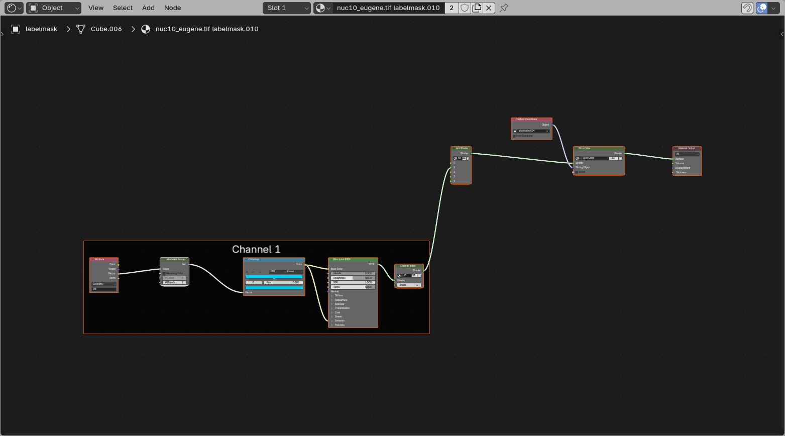
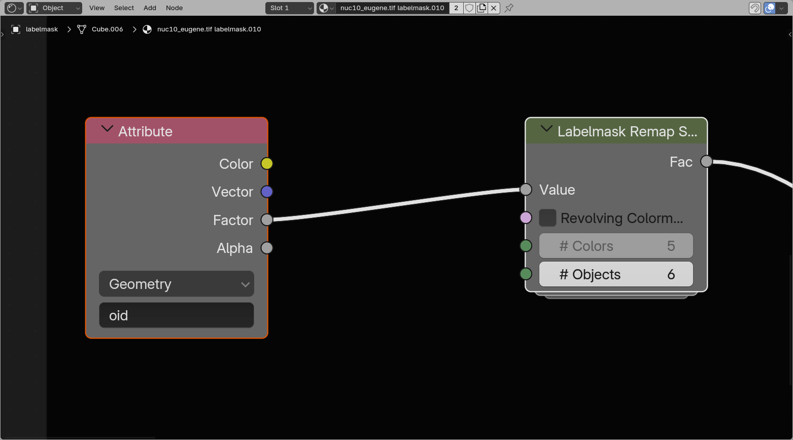
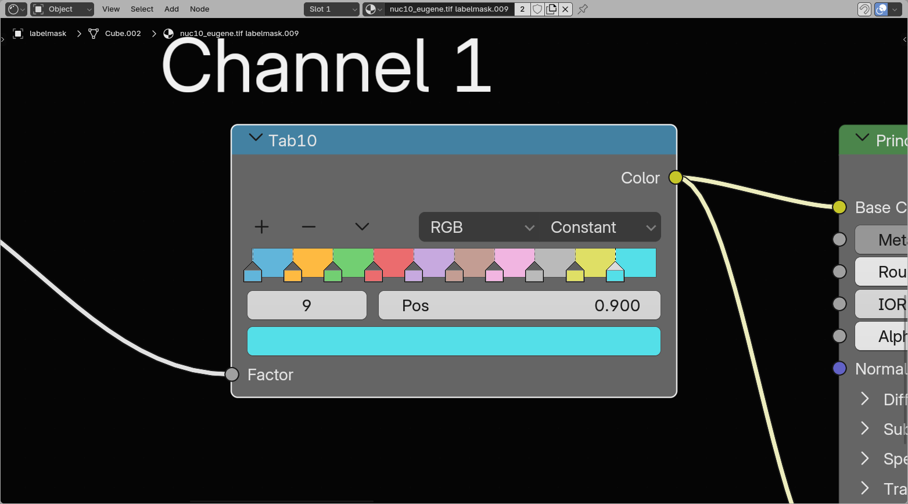
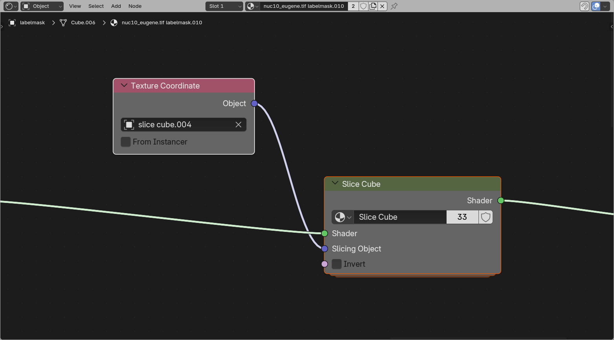

# Labelmask Shading

The {{ svg("outliner_data_pointcloud") }} label mask shader is very similar to the {{ svg("outliner_data_surface") }} Surface shader, but is able to read out and use the `object id` to color by.

## Object ID handling

The `object id` (the value in the label mask) is connected and retrievable from the vertices of the labelmask objects.

This is led into a group that maps it to values between 0 and 1 for the LUT. This has the option of a **revolving sequence**: ideal for a categorical colormap with distinct values, making the object ids loop through these values. Or a **consecutive sequence** scaling all values linearly along the `object id`s, ideal for linear colormaps.

## Color LUT

The color lookup table works similar to the [volume color LUT](./4_volume_shading.md#color-lut). Often categorical colormaps work best for labelmasks, if you have only one channel of masks.

## Mesh shading

{: style="height:350px"}

Like the surface shader, the labelmask shader uses a **Principled BSDF** node for its mesh appearance. The main difference is that the **Base Color** is driven by the labelmask LUT instead of by a single shared surface color.

This means you can still use the usual mesh shading controls such as:

- Roughness
- Specular
- Metallic
- Emission strength

while keeping the per-label coloring from the LUT.

??? warning "Emission can 'flatten' objects"
    The feeling of **depth** in 3D rendering is often due to the interaction of objects with light. When things are emitting light themselves, they can often look flat. For more feeling of depth, it might be better to load with {{ svg("light", "small-icon") }} emission off, and set up some form of lighting.

## Slice cube

The Slice Cube section allows slicing of the labelmask. This has an {{ svg("object_data") }} Object pointer to a cube in the scene (by default the loaded slice cube).

The object bounding box gets fed into the slicer, which hides all regions outside the bounding box.

??? note "How this works"
    The slicing node uses the remapped positions from the **Texture Coordinate** node, compares them to the cube bounds, and removes everything outside that cube space. This is the same basic slicing idea as for volumes and surfaces, but applied to the mesh shader of the labelmask.
