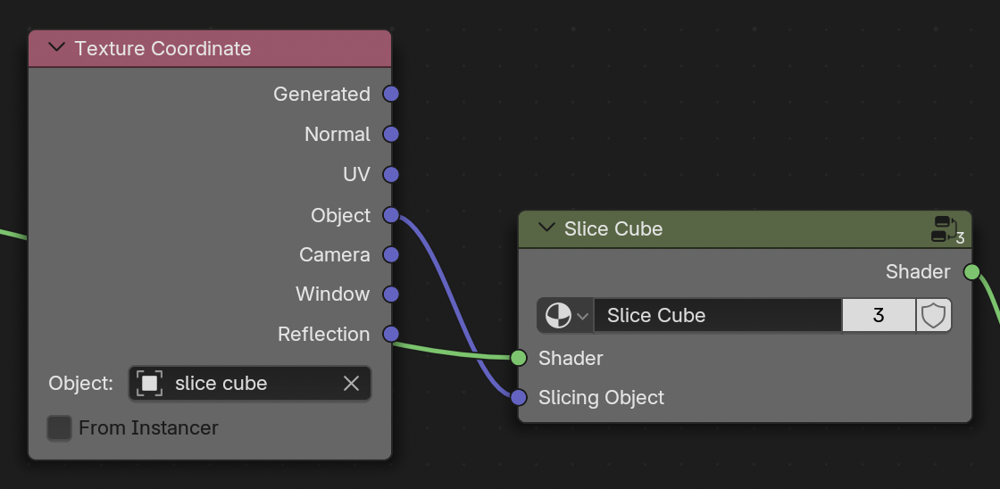

# Shading

**Shading** encompasses the visualization of Blender's objects. The shading options can be found in two places:

- in the {{ svg("workspace") }} Shader Nodes workspace, find this in the {{ svg("topbar") }} topbar.
- in the {{ svg("material") }} material tab of the {{ svg("properties") }} properties.

These two locations contain the same information, laid out in different ways. Often it's easiest to **edit** in the {{ svg("workspace") }} Shader Nodes workspace. And use the {{ svg("properties") }} properties to **switch** between channels. Quick changes can be easier in the {{ svg("properties") }} properties as well.

The default Microscopy Nodes shaders are built from {{ svg("nodetree") }} nodes, and contains information on how the object interacts with **light** and its transparency. The defaults are listed here separately for the different [Microscopy Nodes data-objects](./3_objects.md).

## Volume Shading

The Shader Nodes workspace {{ svg("workspace") }} when selecting a Microscopy Nodes {{ svg("outliner_data_volume") }} volume: 

{: style="height:130px"}

### Data Loading

This is where the data gets read out from the vdb grid (as handed over from the Geometry Nodes) and gets normalized. You will usually not need to edit this.

??? warning "Reusing shaders"
    The normalization that is done in **Normalize Data**  is dependent on the specific data, as it rescales the min and max value of the data to 0 and 1 - after it's already transformed to small floating point values for saving to .vdb files. 
    
    Essentially, this means its best to **keep the normalization** of new data when you replace the rest. Hopefully this can be smoother in the future, but this depends on Blender/Geometry Nodes development in volume handling.

     
    
### Pixel Intensities

The pixel intensities rescale the min and max value, and thus the linear interpolation of the data. This is analogous to a Fiji **Brightness & Contrast** window.

You can move the two handles to move the **min** and **max**. 

??? note "How this works"
    This is a Blender `Color Ramp` that only outputs Alpha, and not Color. We feed in normalized data between 0 and 1 (as represented in histogram) and map this to the color ramp. The color ramp is two nodes of alpha 0 (min) and 1 (max). 

    This also means you can add extra nodes in here if you want nonlinearity in your pixel intensities, or flip the nodes to invert. However, it is often easier to just change the colormap.

### Color LUT

{: style="height:200px"}
{: style="height:200px"}

The lookup tables are `Color Ramp` objects, LUTs can be edited:

- **Editing** handles
    - You can drag to change its position and click on it to get a color picker. To change contrast, its recommended to change the *pixel intensities* instead of the color.
    - The bottom fields are the *index*, *position* and *color* of the selected field - allowing editing of the handles with more precision
- **Replacing** the LUT by {{ svg("mouse_rmb") }} right clicking the LUT and selecting {{ svg("color") }} LUTs. This lists multiple [colormaps](https://cmap-docs.readthedocs.io).
    - {{ svg("ipo_linear") }} Sequential, monotonic rising or falling, often good for microscopy
    - {{ svg("lincurve") }} Diverging, distinctive middle of the colormap
    - {{ svg("mesh_circle") }} Cyclical, start and end together
    - {{ svg("outliner_data_pointcloud") }} Qualitative, separates consecutive values, good for labelmasks
    - {{ svg("add") }} Miscellaneous
    - {{ svg("mesh_plane") }} Single Color, gives a new black-to-white colormap, to easily edit LUTs
- {{ svg("arrow_leftright") }} Flipping the LUT
    - either under the down-carrot or under {{ svg("mouse_rmb") }} right clicking the LUT
    - Flipped LUTs can be [loaded by default](./preferences.md)

### Opacity

The tranparency window describes the total contribution of each voxel to the image. If you are in an emission mode, this defines the volume **brightness**, in scattering mode, this describes the volume **density**.

Here there are multiple options:

- Clip Min
    - Sets all values at 0 as transparent (left from the **min** in *Pixel Intensities*).
- Clip Max
    - Sets all values at 1 to transparent (right from the **max** in *Pixel Intensities*).
- Alpha Baseline
    - Constant alpha for all voxels that are not *Clipped*.
- Alpha Multiplier
    - Alpha value that multiplies the input values, and thus linearly increases with intensity. Does not affect *Clipped* values. Adds onto *Alpha Baseline*.

### Shaders (emission/scatter)

This is where the *Microscopy Nodes* pre-processing hooks into the default Blender volume interfaces. This is split between an {{ svg("outliner_ob_light") }} emissive and {{ svg("light") }} scattering setup. Currently the easiest way to switch between them is through [reloading](./2_loading_data.md).
{: style="height:200px"}
{: style="height:200px"}

??? note "Advanced"
    Some things are editable in here, such as the **Anisotropy** of the scattering, which defines whether there is more backward scattering (less penetrant) or more forward scattering. 

    Additionally, by Adding nodes (from the `Add` menu or `Shift + A`), and connecting these together, it's possible to make combined setups for emissive and scattering shaders.
### Slice Cube

The Slice Cube section allows slicing of the volume. This has an {{ svg("object_data") }} Object pointer to a cube in the scene (by default the loaded slice cube).

The object bounding box gets fed into the slicer, which sets all regions outside the bounding box to transparent. 

??? note "How this works"
    As shown if you press the {{ svg("nodetree", "small-icon") }} icon at the top right of the group, how the slicing node works is to take the remapped locations as the **Texture Coordinate** input provides (mapping the data to the coordinates of the cube space) and compare these to the boundes (1, -1). If positions are not in the range of the cube space, the shader is set to a *Transparent Shader*.

## Surface shading

The {{ svg("outliner_data_surface") }} Surface object shader is more simple than the volumetric, as it can only have **one color**, although it can have many properties. The shader does not explicitly load the data, as the data interaction is all done through the threshold in the {{ svg("modifier") }} Geometry options.

### Color LUT

The color lookup table works similar to the [volume color LUT](#color-lut). However, the surface can only display one value, so the `Fac` value defines where along the lookup table the color is drawn from. 

This is done to more easily align different channels. For a regular **color picker** you can leave the `Fac` at `1` and click the rightmost handle. The other way would be to replace this box with a color box (`Add > Input > RGB`)

### Mesh shading

{: style="height:350px"}

The **Principled BSDF** node is a combined node that combines features to create different material properties. The [Blender manual](https://docs.blender.org/manual/en/latest/render/shader_nodes/shader/principled.html) {{ svg("blender") }} gives a complete manual to its features. 

By default this has two inputs set differently from Blender default, the **Base Color** and **Emission Color/Strength**. These colors are set to link to the Color LUT. 

The **Emission Strength** is set to 0 or 0.5 depending on whether this was loaded with {{ svg("outliner_ob_light") }} emission on or {{ svg("light") }} emission off. This is done for consistency, and that dark scenes have masks and surfaces as clearly visible as data, without setting up lighting.

??? warning "Emission can 'flatten' objects"
    The feeling of **depth** in 3D rendering is often due to the interaction of objects with light. When things are emitting light themselves, they can often look flat. For more feeling of depth, it might be better to load with {{ svg("light", "small-icon") }} emission off, and set up some form of lighting.

### Slice cube

This is exactly similar to the [volume Slice Cube](#slice-cube).

## Labelmask shading

The {{ svg("outliner_data_pointcloud") }} label mask shader is very similar to the {{ svg("outliner_data_surface") }} Surface shader, but is able to read out and use the `object id` to color by.

### Object ID handling

The `object id` (the value in the label mask) is connected and retrievable from the vertices of the labelmask objects. 

This is led into a group that maps it to values between 0 and 1 for the LUT. This has the option of a **revolving sequence**: ideal for a categorical colormap with distinct values, making the object ids loop through these values. Or a **consecutive sequence** scaling all values linearly along the `object id`s, ideal for linear colormaps.

### Color LUT

The color lookup table works similar to the [volume color LUT](#color-lut). Often categorical colormaps work best for labelmasks, if you have only one channel of masks.

### Slice cube

This is exactly similar to the [volume Slice Cube](#slice-cube).

