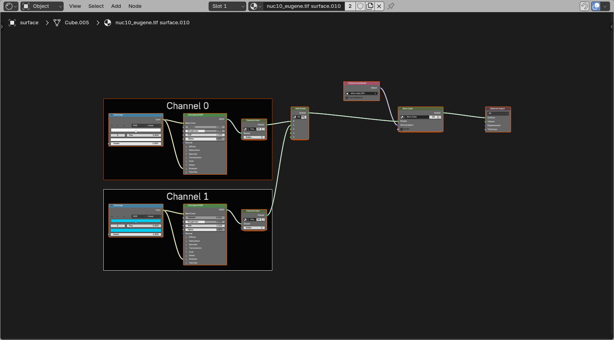
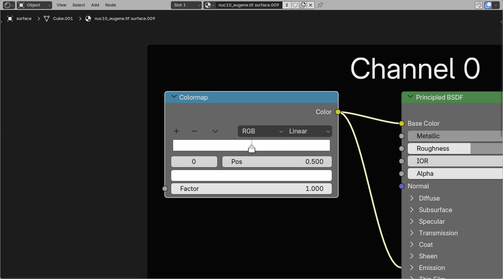
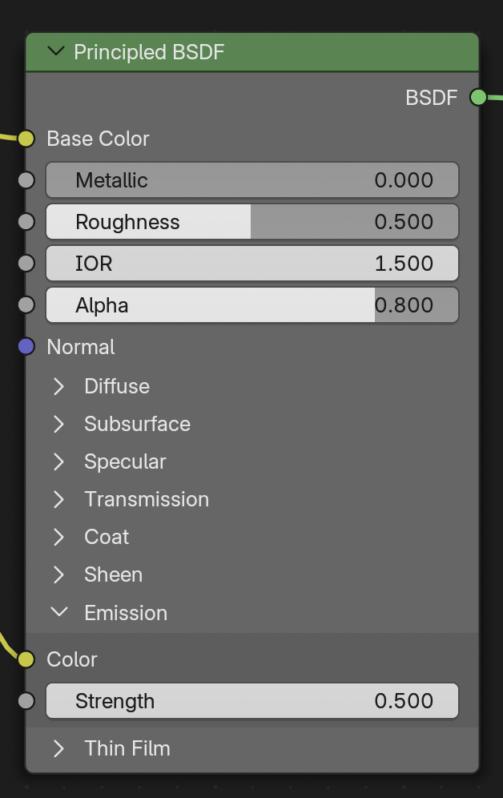
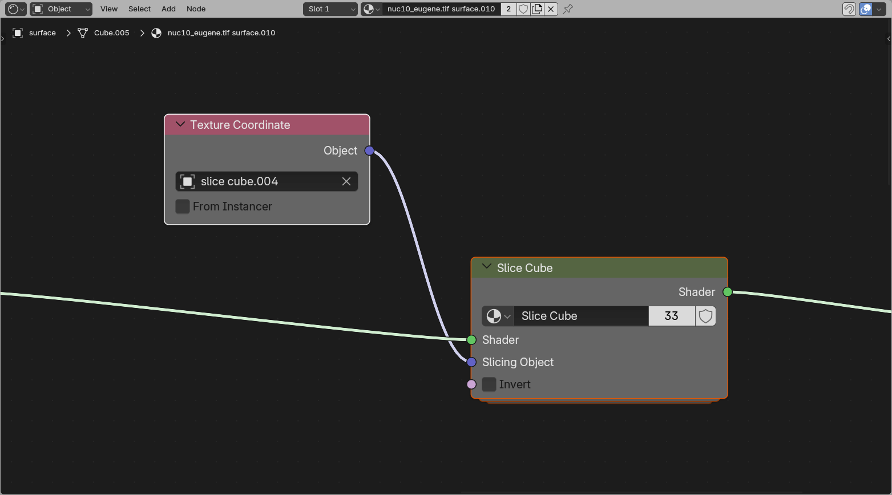

# Surface Shading

The {{ svg("outliner_data_surface") }} Surface object shader is more simple than the volumetric, as it can only have **one color**, although it can have many properties. The shader does not explicitly load the data, as the data interaction is all done through the threshold in the {{ svg("modifier") }} Geometry options.

## Color LUT

The color lookup table works similar to the [volume color LUT](./4_volume_shading.md#color-lut). However, the surface can only display one value, so the `Fac` value defines where along the lookup table the color is drawn from.

For a regular **color picker** you can leave the `Fac` at `1` and click the rightmost handle. The other way would be to replace this box with a color box (`Add > Input > RGB`)

## Mesh shading

{: style="height:350px"}

The **Principled BSDF** node is a combined node that combines features to create different material properties. The [Blender manual](https://docs.blender.org/manual/en/latest/render/shader_nodes/shader/principled.html) {{ svg("blender") }} gives a complete manual to its features.

By default this has two inputs set differently from Blender default, the **Base Color** and **Emission Color/Strength**. These colors are set to link to the Color LUT.

The **Emission Strength** is set to 0 or 0.5 depending on whether this was loaded with {{ svg("outliner_ob_light") }} emission on or {{ svg("light") }} emission off. This is done for consistency, and that dark scenes have masks and surfaces as clearly visible as data, without setting up lighting.

??? warning "Emission can 'flatten' objects"
    The feeling of **depth** in 3D rendering is often due to the interaction of objects with light. When things are emitting light themselves, they can often look flat. For more feeling of depth, it might be better to load with {{ svg("light", "small-icon") }} emission off, and set up some form of lighting.

## Slice cube

The Slice Cube section allows slicing of the surface. This has an {{ svg("object_data") }} Object pointer to a cube in the scene (by default the loaded slice cube).

The object bounding box gets fed into the slicer, which hides all regions outside the bounding box.

??? note "How this works"
    The slicing node uses the remapped positions from the **Texture Coordinate** node, compares them to the cube bounds, and removes everything outside that cube space. This makes the surface behave consistently with the volume slicer while still staying a regular mesh shader.
