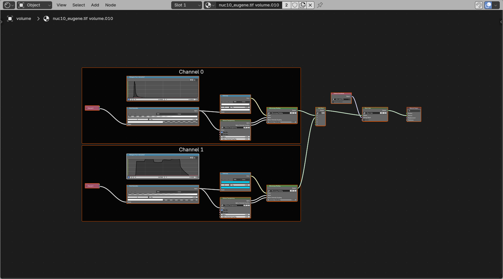
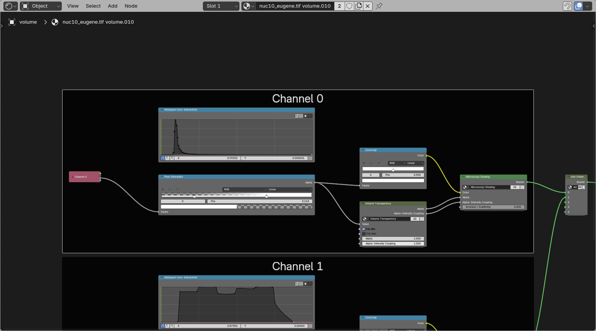
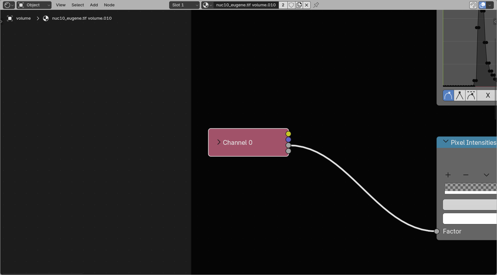
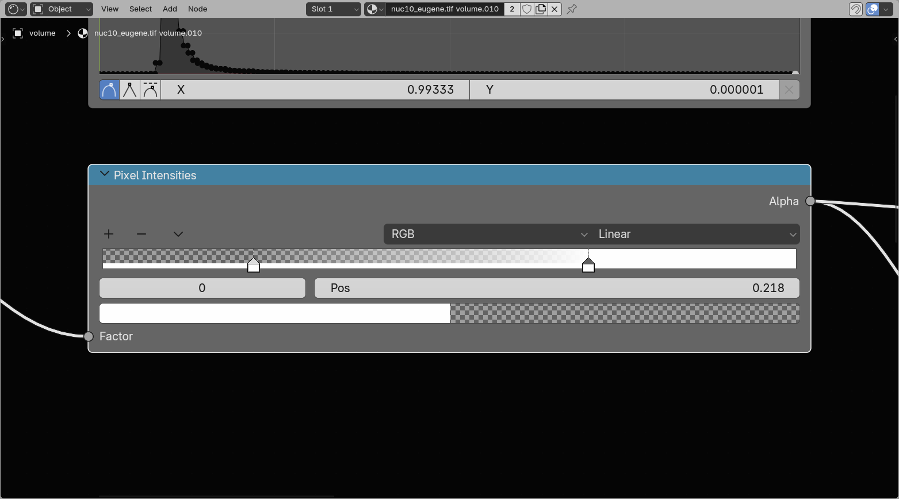
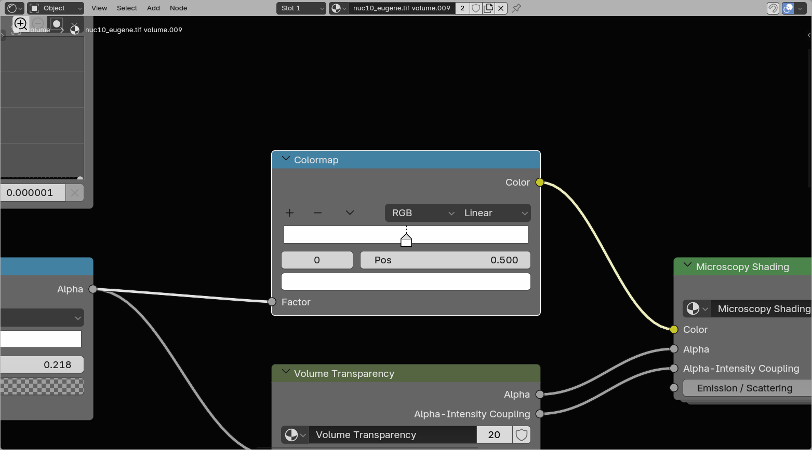
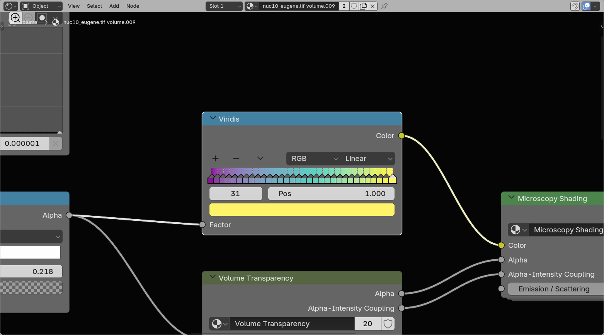
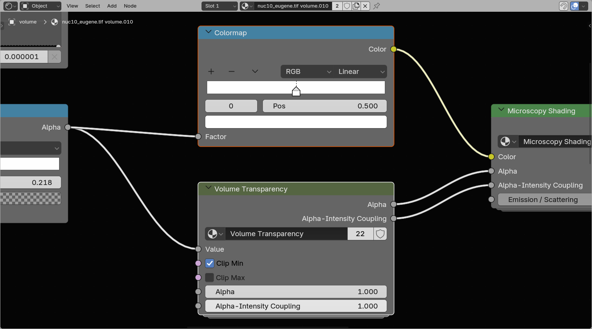
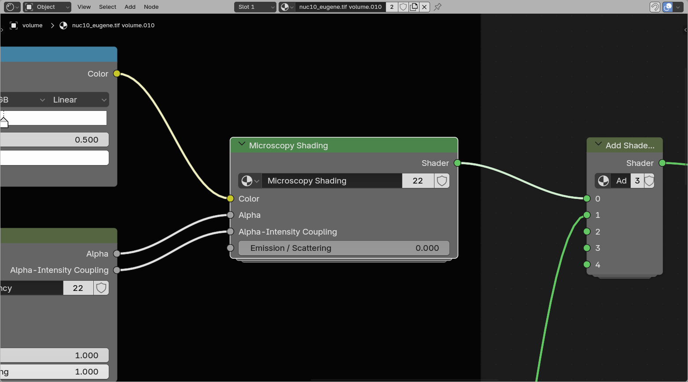
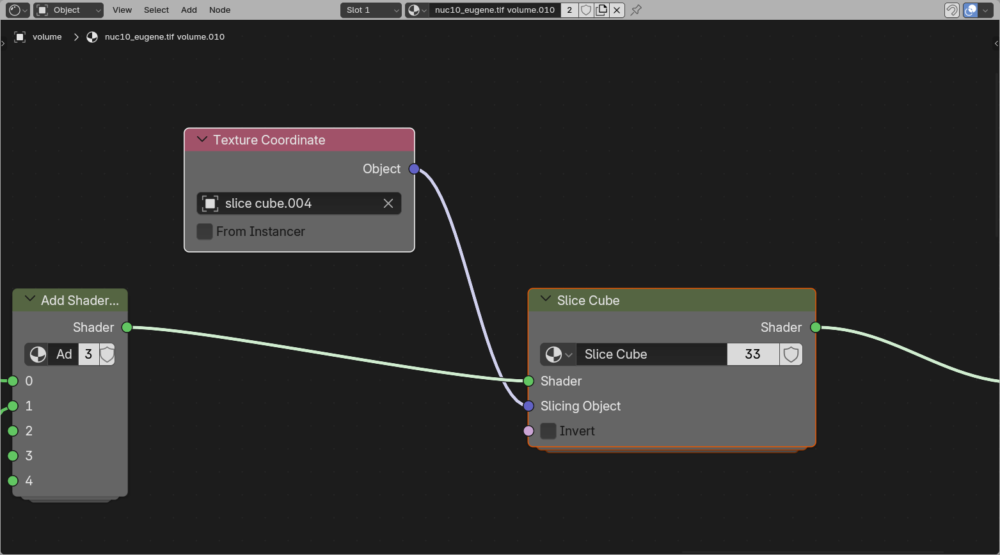

# Volume Shading

The Shader Nodes workspace {{ svg("workspace") }} when selecting a Microscopy Nodes {{ svg("outliner_data_volume") }} volume:

All loaded volume channels live in this one shared shader. Each channel has its own **Channel** frame with its own loading, transfer function, and shading controls. The channel outputs are then added together and passed through the shared slicing setup.

## Channel

This frame contains the settings for one single channel. If multiple channels are loaded as volumes, each one gets its own copy of this frame inside the same material.

## Data Loading

This is where the single-channel `Grid` attribute gets read out from the volume grids handed over by the Geometry Nodes setup.

??? warning "Reusing shaders"
    The channel input setup is still specific to the loaded data, because it points to the per-channel `Grid` information coming from Geometry Nodes.

    

## Pixel Intensities

The pixel intensities rescale the min and max value, and thus the linear interpolation of the data. This is analogous to a Fiji **Brightness & Contrast** window.

You can move the two handles to move the **min** and **max**.

??? note "How this works"
    This is a Blender `Color Ramp` that only outputs Alpha, and not Color. We feed in normalized data between 0 and 1 (as represented in histogram) and map this to the color ramp. The color ramp is two nodes of alpha 0 (min) and 1 (max).

    This also means you can add extra nodes in here if you want nonlinearity in your pixel intensities, or flip the nodes to invert. However, it is often easier to just change the colormap.

## Color LUT

On load, a volume channel usually starts as a single-color ramp. Replacing the LUT swaps that ramp for a full colormap such as `viridis`.

The lookup tables are `Color Ramp` objects, LUTs can be edited:

- **Editing** handles
    - You can drag to change its position and click on it to get a color picker. To change contrast, its recommended to change the *pixel intensities* instead of the color.
    - The bottom fields are the *index*, *position* and *color* of the selected field - allowing editing of the handles with more precision
- **Replacing** the LUT by {{ svg("mouse_rmb") }} right clicking the LUT and selecting {{ svg("color") }} LUTs. This lists multiple [colormaps](https://cmap-docs.readthedocs.io).
    - {{ svg("ipo_linear") }} Sequential, monotonic rising or falling, often good for microscopy
    - {{ svg("lincurve") }} Diverging, distinctive middle of the colormap
    - {{ svg("mesh_circle") }} Cyclical, start and end together
    - {{ svg("outliner_data_pointcloud") }} Qualitative, separates consecutive values, good for labelmasks
    - {{ svg("add") }} Miscellaneous
    - {{ svg("mesh_plane") }} Single Color, gives a new black-to-white colormap, to easily edit LUTs
- {{ svg("arrow_leftright") }} Flipping the LUT
    - either under the down-carrot or under {{ svg("mouse_rmb") }} right clicking the LUT
    - Flipped LUTs can be [loaded by default](./preferences.md)

## Volume Transparency

The **Volume Transparency** group controls how strongly each voxel contributes to the final image. It works together with the LUT and pixel intensities, but focuses only on transparency and accumulation.

Here there are multiple options:

- Clip Min
    - Sets all values at 0 as transparent (left from the **min** in *Pixel Intensities*).
- Clip Max
    - Sets all values at 1 to transparent (right from the **max** in *Pixel Intensities*).
- Alpha
    - The base transparency contribution of the volume after clipping.
- Alpha-Intensity Coupling
    - Controls how strongly the transparency follows the intensity values. Lower values keep the volume more evenly transparent, while higher values make brighter voxels contribute more strongly.

## Shaders (emission/scatter)

This is where the *Microscopy Nodes* preprocessing hooks into Blender's built-in volume shaders. The node group contains both an {{ svg("outliner_ob_light") }} emissive and a {{ svg("light") }} scattering branch, and you can dynamically switch between them or mix them.

??? note "Advanced"
    Some things are editable in here, such as the **Anisotropy** of the scattering, which defines whether there is more backward scattering (less penetrant) or more forward scattering.

    Additionally, by adding nodes (from the `Add` menu or `Shift + A`) and reconnecting the branches, it's possible to build custom combinations of emissive and scattering setups.

## Slice Cube

The Slice Cube section allows slicing of the volume. This has an {{ svg("object_data") }} Object pointer to a cube in the scene (by default the loaded slice cube).

The object bounding box gets fed into the slicer, which sets all regions outside the bounding box to transparent.

??? note "How this works"
    As shown if you press the {{ svg("nodetree", "small-icon") }} icon at the top right of the group, how the slicing node works is to take the remapped locations as the **Texture Coordinate** input provides (mapping the data to the coordinates of the cube space) and compare these to the boundes (1, -1). If positions are not in the range of the cube space, the shader is set to a *Transparent Shader*.
