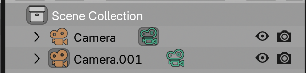

# Creating output

Creating output from a scene in Blender is done by adding a {{ svg("view_camera") }} and pressing `Render > Render Image` or `Render > Render Animation` for the full animation

{{ youtube("jcERgoBI1b8", 360, 200) }}

## Adding and moving the camera

Adding a camera can be done from the {{ svg("view3d") }} 3D viewport by pressing `Add` or `Shift + A`, and finding the {{ svg("view_camera") }} camera in the submenu.

The camera can be moved as any object but has a few extra features.

### Active Camera

The active camera is the camera in the scene that will be used in rendering, and can be switched and selected through the green {{ svg("view_camera") }} camera icon in the {{ svg("outliner") }} outliner.

### Viewing through the active camera

The view through the current **active** {{ svg("view_camera") }} **camera** can be seen by clicking the {{ svg("view_camera") }} camera icon on the right of the {{ svg("view3d") }} 3D viewport.

### Aligning view

The **easiest** way for beginners to set the camera direction is by aligning it to the view. This means:

- Setting a nice view angle and position
- Aligning the camera with `View > Align View > Align Active Camera To View`

### Camera properties

Camera properties can be found under the {{ svg("view_camera") }} camera icon in the {{ svg("properties") }} properties. This is where the camera can be switched between **perspective** and **orthographic** modes, or the focal length set for a perspective camera.

## Setting up lighting

Lighting can be very important for getting a good feeling of depth for the data, but it is not always necessary or essential.

In {{ svg("light") }} emissive renders, it is often not necessary to set up light. 

In {{ svg("outliner_ob_light") }} non-emissive renders, the Microscopy Nodes default is to use the {{ svg("world") }} world color and brightness to light the scene. However, setting up specific lighting can give less flat-seeming renders.

You can set up lights by adding them from the `Add` menu, as objects, moving them and changing their `Power` and `Color` in the {{ svg("properties") }} properties.

## Basic animation

Animation can be very intricate, but the basics and getting started can be straightforward. The way this works is by setting {{ svg("keyframe") }} keyframes. These are a set value at a set timepoint, if this value is different at another keyframe, Blender will interpolate between the two points.

The nice part of Blender is that almost any value can be keyframed. You can set a keyframe by hovering over a value and pressing `I`.

So a simple camera animation setup takes:

- Set the camera 
- Set the {{ svg("time") }} timeline at timepoint 0
- Hover over the camera `Location` and `Rotation` in the {{ svg("properties") }} properties and press `I`, setting a keyframe.
- Set the {{ svg("time") }} timeline at timepoint 100
- Set the camera to a new position
- Again hover over the camera `Location` and `Rotation` in the {{ svg("properties") }} properties and press `I`, setting a keyframe.

Then in between the two keyframes, Blender will interpolate the camera positioning.

## Rendering

Rendering can be done with `Render > Render Image` or `Render > Render Animation`. It can be useful to still check out the [render settings](./rendering.md) 