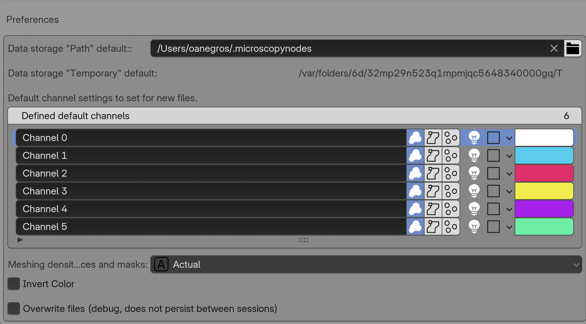

# Preferences / Customization

The {{ svg("microscopy_nodes") }} Microscopy Nodes addon has {{ svg("preferences") }} **Preferences** to allow for a custom experience and defaults. 

You can find these under `Edit > Preferences > Add-ons > Microscopy Nodes`.

Here we get multiple options for defaults and settings:

- Default "Path"
  > The cache path that is set if the [load option](./2_loading_data.md#5-extra-import-settings-optional) `Path` is selected   
- Default "Temporary"
  > The cache path that is generated when [load option](./2_loading_data.md#5-extra-import-settings-optional) `Temporary` is selected   
- Default channels + channel number
  > This defines the default settings for the [channel interface](./2_loading_data.md#4-set-channels) when a new dataset is loaded. If more channels are present in the data than defaults, the list revolves. 
- Extra channel slots
  > Reserves empty channel entries for adding derived or separately masked grids to the Geometry Nodes and shader channel bundles.
- On load slice cube mode
  > {{ svg("material") }} **Shader** gives a clean bounding-box slice. {{ svg("geometry_nodes") }} **Geometry** creates voxel masks that can use custom shapes, separate inside/outside regions, and drive sparse reloading. See [Slice, mask, and recolor data](./slicing_masking.md).
- Mesh density
  > This sets how fine/coarse the geometries for labelmasks and surfaces are 
- Invert Color
  > Inverts all colormaps on load and replace
- Overwrite local files (debug)
  > If reloading fails for some reason, this is useful to check, but is usually only used for development.
