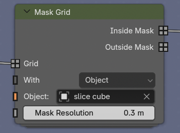

# Slice, mask, and recolor data

Masking lets different spatial or segmented regions of one dataset use independent colors, visibility, and animation.

{{ youtube("gIFsRT1ZGyg", 560, 315) }}

## Choose a slicing method

Microscopy Nodes offers two slicing modes when loading or reloading:

| Mode | Best for | Limitation |
| --- | --- | --- |
| {{ svg("material") }} **Shader slicing** | A clean, movable box slice | One box; the data itself is not masked |
| {{ svg("geometry_nodes") }} **Geometry slicing** | Custom objects, labels, multiple regions, and sparse reloads | The mask is voxelized and can show stair-step artifacts |

Shader slicing is the default. Choose geometry slicing with {{ svg("geometry_nodes") }} in the loading panel's **On load – Slicing** controls when you need the more flexible workflows below.

## Use the Slice Cube

The loaded {{ svg("outliner_ob_mesh") }} Slice Cube can be moved, rotated, or scaled like any Blender object:

- `G` moves it;
- `R` rotates it;
- `S` scales it;
- press `X`, `Y`, or `Z` after a transform to constrain the action to one axis.

With geometry slicing, each channel passes through a **Mask Grid** node. Its default box mode uses the Slice Cube and provides separate **Inside** and **Outside** grid outputs.

## Mask with any object

This workflow requires a **Mask Grid** node in the volume's Geometry Nodes tree. It is added automatically when the dataset is loaded or reloaded with {{ svg("geometry_nodes") }} **Geometry slicing**. If the dataset was loaded with {{ svg("material") }} Shader slicing, add a **Mask Grid** node yourself and connect the channel grid to its **Grid** input, then connect **Inside Mask** or **Outside Mask** to the channel bundle in place of the original grid.

In the **Mask Grid** node, use **With** to choose the mask source:

- **Object** or **Collection** voxelizes Blender geometry;
- **Mesh** accepts geometry already available in the node tree;
- **Grid** accepts an existing mask grid;
- **Box** uses an object's bounding box, as in the default Slice Cube setup.

Set the corresponding Object, Collection, Mesh, or Mask input. This allows an icosphere, a sculpted mesh, an isosurface, or a segmentation to define the visible region. **Inside Mask** keeps data inside the source; **Outside Mask** keeps its complement.

The mask resolution controls how finely Blender voxelizes an object. A finer value follows curved surfaces more closely but requires more computation.

## Give regions independent appearances

To color the inside and outside differently:

1. Keep one Mask Grid output connected to the original channel.
2. Add a second channel to the Geometry Nodes channel bundle.
3. Connect the other mask output to that channel.
4. Add a matching channel in the {{ svg("material") }} shader.
5. Give each shader branch its own intensity limits, LUT, alpha, or emission settings.

The channel names in Geometry Nodes and Shader Nodes must match.

## Use segmentations without losing intensity

A {{ svg("outliner_ob_pointcloud") }} label mask or generated {{ svg("outliner_ob_surface") }} surface can define a volume mask. The masked region still contains the original intensity values from the source volume, so it can be recolored without replacing the microscopy signal with a flat segmentation surface.

This is particularly useful for dense EM data: show the complete volume in grayscale while highlighting annotated organelles with a separate color map.

## Understand mask artifacts

Geometry masks operate at voxel resolution. Curved or rotated boundaries may therefore show voxel-shaped striations, especially at a strongly downsampled scale.

- Increase the mask resolution for a finer boundary.
- Work at a higher data scale when the final result requires it.
- Prefer shader slicing when you only need a clean box cut.

The resulting mask can also define which voxels are loaded at high resolution. Continue with [Large datasets and sparse reloading](./large_data.md).
